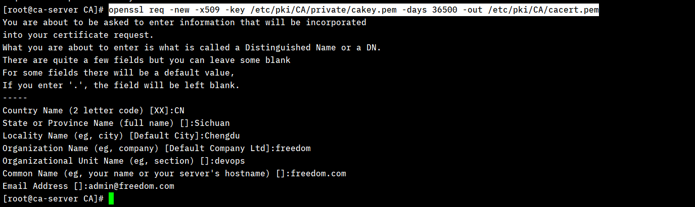
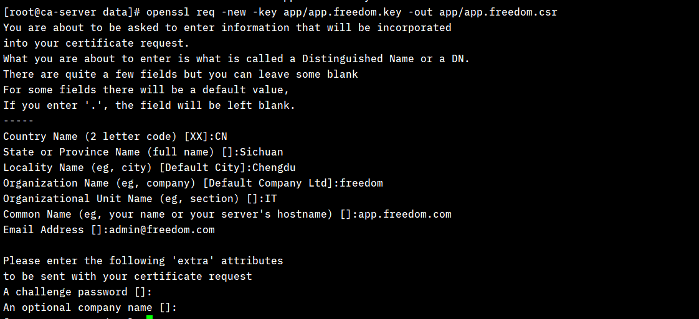
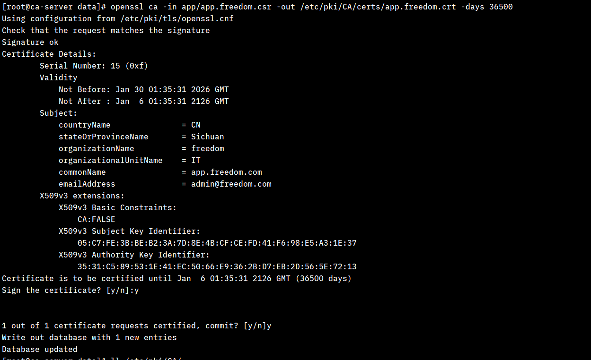

##### 实现私有CA生成，申请详解
- **描述**
    1. 生成 CA 相关密钥文件
    2. 生成申请 CA 请求相关文件
    3. 进行 CA 证书申请

- **根据`/etc/pki/tls/openssl.cnf`配置中dir,初始化CA目录**
```bash
# 创建CA目录
mkdir -pv /etc/pki/CA/{certs,crl,newcerts,private}
# 创建 index.txt 和 serial 文件
touch /etc/pki/CA/index.txt
echo '0F' >/etc/pki/CA/serial
```

- **步骤**
    
    1. 生成 CA 相关密钥文件
    ```bash
    # 生成 CA 私钥
    cd /etc/pki/CA
    (umask 066; openssl genrsa -out private/cakey.pem 2048)

    # 生成 CA 自签名证书
    openssl req -new -x509 -key /etc/pki/CA/private/cakey.pem -days 36500 -out /etc/pki/CA/cacert.pem
    # 查看生成的自签名证书: openssl x509 -in /etc/pki/CA/cacert.pem -noout -text
    # 相关输出如下图, 注意：在进行申请证书相关时，下图中的相关内容要按照openssl.cnf中相关配置的策略[policy_match]严格匹配
    ```
    
    2. 生成申请 CA 请求相关文件
    ```bash
    # 生成应用的私钥文件
    (umask 066; openssl genrsa -out app/app.freedom.key 2048)
    # 生成证书申请文件
    openssl req -new -key app/app.freedom.key -out app/app.freedom.csr
    # 相关输出如下图, 注意这里输入的相关参数与上面相关的某些项要匹配,详细参考/etc/pki/tls/openssl.cnf中的配置
    ```
    
    3. 进行 CA 证书申请
    ```bash
    # 签署 CA , 并将 CA 颁发给请求者
    openssl ca -in app/app.freedom.csr -out /etc/pki/CA/certs/app.freedom.crt -days 36500
    # 查看证书: openssl x509 -in /etc/pki/CA/certs/app.freedom.crt -noout -text
    # 将证书拷贝至app路径: cp /etc/pki/CA/certs/app.freedom.crt app/; app路径包含三个文件:
    #     app
    #       ├── app.freedom.crt
    #       ├── app.freedom.csr
    #       └── app.freedom.key
    # 将 app 中的证书打包给应用或者用户使用
    ```
    

- **证书吊销**
    1. 查看证书的serial: openssl x509 -in /etc/pki/CA/certs/app.freedom.crt -noout -serial
    2. 吊销作废的证书: openssl ca -revoke /etc/pki/CA/newcerts/0F.pem
    3. 发布吊销证书列表：
        1. 第一次更新吊销列表前执行(仅一次): echo 01 >/etc/pki/CA/crlnumber
        2. 更新吊销证书列表: openssl ca -gencrl -out /etc/pki/CA/crl.pem
        3. 查看吊销证书列表: openssl crl -in /etc/pki/CA/crl.pem -noout -text
        4. 后续可以发布吊销证书文件: /etc/pki/CA/crl.pem

- **最终生成的文件目录结构**


---
##### 简单版本脚本
```bash
#!/bin/bash

set -e

# 配置证书过期时间(天)
EXPIRED_TIME=36500
CA_EXPIRED_TIME=36500

if ! command -v openssl >/dev/null; then
    echo "openssl command not exists, please install it!"
    exit
fi

# 如果还没有CA，先创建CA
if [ ! -f ca.crt ]; then
    echo "Creating CA..."
    openssl req -x509 -new -nodes \
        -newkey rsa:4096 -keyout ca.key -out ca.crt \
        -days ${CA_EXPIRED_TIME} -sha256 \
        -subj "/C=CN/ST=SC/L=CD/O=laazua/CN=MyCA"
fi

# 生成服务端证书
echo "Generating server certificate..."
openssl req -new -nodes \
    -newkey rsa:2048 -keyout server.key -out server.csr \
    -subj "/C=CN/ST=SC/L=CD/O=laazua/CN=localhost"

openssl x509 -req -in server.csr \
    -CA ca.crt -CAkey ca.key -CAcreateserial \
    -out server.crt -days ${EXPIRED_TIME} -sha256 \
    -extfile <(cat <<EOF
basicConstraints = CA:FALSE
keyUsage = digitalSignature, keyEncipherment
extendedKeyUsage = serverAuth
EOF
)

# 生成客户端证书
echo "Generating client certificate..."
openssl req -new -nodes \
    -newkey rsa:2048 -keyout client.key -out client.csr \
    -subj "/C=CN/ST=SC/L=CD/O=laazua/CN=client"


openssl x509 -req -in client.csr \
    -CA ca.crt -CAkey ca.key -CAserial ca.srl \
    -out client.crt -days ${EXPIRED_TIME} -sha256 \
    -extfile <(cat <<EOF
basicConstraints = CA:FALSE
keyUsage = digitalSignature
extendedKeyUsage = clientAuth
EOF
)

# 清理临时文件
rm -f *.csr *.srl

echo "Done! Generated certificates:"
echo "  CA: ca.crt, ca.key"
echo "  Server: server.crt, server.key"
echo "  Client: client.crt, client.key"

# 验证
echo -e "\nVerifying certificates..."
openssl verify -CAfile ca.crt server.crt
openssl verify -CAfile ca.crt client.crt
```